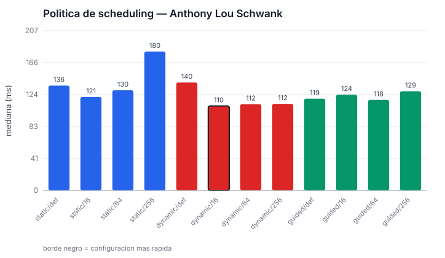
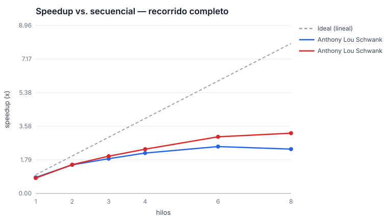
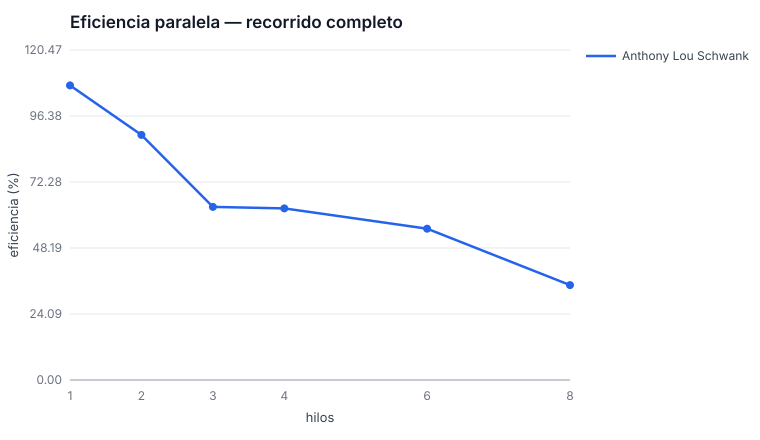
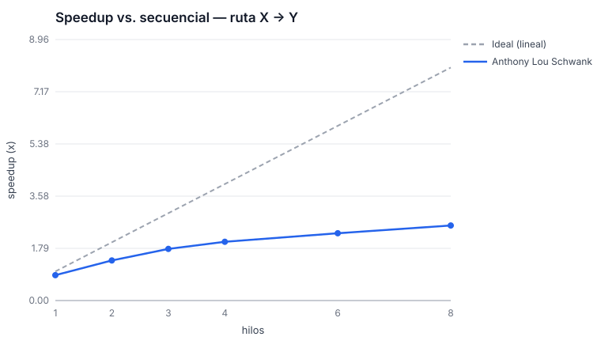

# Resultados consolidados

*Generado por `docs/benchmarks/analizar.py`. No editar a mano: se regenera.*

Todos los tiempos son **medianas** de las repeticiones. Se usa la mediana y no el promedio porque en una laptop cualquier tarea del sistema operativo produce valores atipicos que arrastran el promedio.

## Equipos de medicion

| Maquina | Integrante | CPU | Núcleos físicos | Hilos lógicos | RAM | Compilador |
|---|---|---|---:|---:|---|---|
| `laptop-i7-11370h` | Anthony Lou Schwank | 11th Gen Intel(R) Core(TM) i7-11370H @ 3.30GHz | 4 | 8 | 7.6Gi | g++ (Ubuntu 13.3.0-6ubuntu2~24.04.1) 13.3.0 |

---

## Anthony Lou Schwank — maquina `laptop-i7-11370h`

Red de **2 000 000 usuarios** y **15 999 964 amistades**, semilla fija.

### Escenario B — recorrido completo de la red

Metrica principal de escalabilidad: la version secuencial y la paralela recorren exactamente el mismo numero de amistades, asi que la comparacion es limpia.

Baseline secuencial (BFS por frontera, binario sin OpenMP): **454.82 ms**.
BFS de cola clasico, misma maquina: 566.18 ms.

| Hilos | Mediana (ms) | Speedup vs. secuencial | Eficiencia | Speedup vs. 1 hilo | Eficiencia |
|---:|---:|---:|---:|---:|---:|
| 1 | 422.84 | 1.08x | 108% | 1.00x | 100% |
| 2 | 254.13 | 1.79x | 89% | 1.66x | 83% |
| 3 | 239.97 | 1.90x | 63% | 1.76x | 59% |
| 4 | 181.51 | 2.51x | 63% | 2.33x | 58% |
| 6 | 137.21 | 3.31x | 55% | 3.08x | 51% |
| 8 | 164.19 | 2.77x | 35% | 2.58x | 32% |

> Esta maquina tiene **4 nucleos fisicos**. Mas alla de ese numero los hilos comparten unidades de ejecucion (Hyper-Threading/SMT), asi que la eficiencia baja por definicion: no hay mas nucleos entre los que repartir.

### Escenario A — ruta minima usuario X -> usuario Y

La consulta real del enunciado. El corte anticipado hace que el trabajo dependa del nivel en que aparece el destino.

Baseline secuencial (BFS por frontera, binario sin OpenMP): **168.33 ms**.
BFS de cola clasico, misma maquina: 41.45 ms.

| Hilos | Mediana (ms) | Speedup vs. secuencial | Eficiencia | Speedup vs. 1 hilo | Eficiencia |
|---:|---:|---:|---:|---:|---:|
| 1 | 180.29 | 0.93x | 93% | 1.00x | 100% |
| 2 | 129.48 | 1.30x | 65% | 1.39x | 70% |
| 3 | 89.25 | 1.89x | 63% | 2.02x | 67% |
| 4 | 66.75 | 2.52x | 63% | 2.70x | 68% |
| 6 | 51.36 | 3.28x | 55% | 3.51x | 59% |
| 8 | 49.29 | 3.41x | 43% | 3.66x | 46% |

> El mejor secuencial en este escenario no es el BFS por frontera (168.33 ms) sino el BFS de cola clasico (41.45 ms), porque puede abandonar a media capa al descubrir el destino. Contra ese, el speedup real es **0.84x**, no el de la tabla.

> Esta maquina tiene **4 nucleos fisicos**. Mas alla de ese numero los hilos comparten unidades de ejecucion (Hyper-Threading/SMT), asi que la eficiencia baja por definicion: no hay mas nucleos entre los que repartir.

### Politicas de reparto de carga

Esta es la respuesta directa a la pregunta del enunciado: como repartir la exploracion sin que un hilo quede solo con las amistades de un hub.

| Scheduling | Chunk | Mediana (ms) | Frente a la mejor |
|---|---:|---:|---:|
| static | default | 117.50 | +6.5% |
| static | 16 | 116.82 | +5.9% |
| static | 64 | 126.20 | +14.4% |
| static | 256 | 113.70 | +3.1% |
| dynamic | default | 160.55 | +45.6% |
| dynamic | 16 | 110.30 | +0.0% |
| dynamic | 64 | 192.38 | +74.4% |
| dynamic | 256 | 141.85 | +28.6% |
| guided | default | 136.97 | +24.2% |
| guided | 16 | 187.73 | +70.2% |
| guided | 64 | 125.73 | +14.0% |
| guided | 256 | 123.14 | +11.6% |

---

## Graficas

